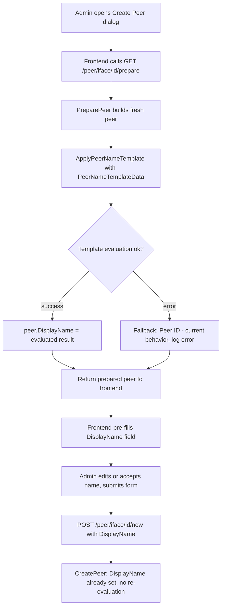

# Design Document: peer-template-name

## Overview

This feature adds a `peer_template_name` configuration parameter to WireGuard Portal's `Core` config section. Administrators can define a Go template string that is evaluated at peer creation time to produce the peer's `DisplayName`. The template supports variables drawn from the peer's own identity and the linked user's profile. When the parameter is absent or empty, the system falls back to the existing behavior (`Peer <truncated-id>`), preserving full backward compatibility.

The change touches four layers:

1. **Config** — new field in the `Core` struct
2. **Domain** — new `PeerNameTemplateData` struct and `ApplyPeerNameTemplate` helper; updated `GenerateDisplayName`
3. **Service** — all peer creation paths pass template config and user data
4. **Frontend** — "Create Peer" dialog pre-fills `DisplayName` from the backend's prepared peer response (no new endpoint needed)

---

## Architecture



`peer_template_name` always has a value — either the user-configured one or the default `"Peer {{.Random}}"`. Template evaluation happens **once**, inside `PreparePeer` (and the other creation paths), not at save time. The frontend receives a fully-evaluated `DisplayName` and treats it as a regular editable string.

---

## Components and Interfaces

### 1. Config (`internal/config/config.go`)

Add `PeerTemplateName` to the anonymous `Core` struct:

```go
Core struct {
    // ... existing fields ...
    PeerTemplateName string `yaml:"peer_template_name"`
}
```

In `defaultConfig()`, set the default:

```go
cfg.Core.PeerTemplateName = getEnvStr("WG_PORTAL_CORE_PEER_TEMPLATE_NAME", "Peer {{.Random}}")
```

### 2. Domain (`internal/domain/peer.go`)

#### `PeerNameTemplateData`

```go
type PeerNameTemplateData struct {
    Id        string // first 8 chars of peer public key
    Random    string // 8-char random alphanumeric string
    Email     string // linked user's email, or ""
    Firstname string // linked user's first name, or ""
    Lastname  string // linked user's last name, or ""
    PeerName  string // "Peer <Id>" — the legacy default name without prefix
}
```

#### `ApplyPeerNameTemplate`

```go
func ApplyPeerNameTemplate(tmpl string, data PeerNameTemplateData) (string, error)
```

- Parses `tmpl` with `text/template`.
- Executes against `data`, writing to a `strings.Builder`.
- Returns the rendered string, or an error if parsing/execution fails.

#### Updated `GenerateDisplayName`

The existing signature changes to accept template config and optional user:

```go
func (p *Peer) GenerateDisplayName(prefix string, tmpl string, user *User)
```

Behavior:
1. Build `PeerNameTemplateData` from `p` and `user`.
2. Always call `ApplyPeerNameTemplate` with the effective template (`tmpl` if non-empty, otherwise the default `"Peer {{.Random}}"`). On success, set `p.DisplayName` to the result.
3. On template parse/execution error, log the error and fall back to `"Peer {ID}"` (current behavior).

> Rationale: keeping the `prefix` parameter means existing callers that pass `"Default"` or `"API"` still work when no template is configured, and the template replaces the entire name (including prefix) when configured.

### 3. Service layer

#### `wireguard_peers.go` — `PreparePeer`

After generating the fresh peer, replace:
```go
freshPeer.GenerateDisplayName("")
```
with:
```go
freshPeer.GenerateDisplayName("", m.cfg.Core.PeerTemplateName, currentUserObj)
```
where `currentUserObj` is fetched from the DB using `currentUser.Id` (already available in context).

#### `wireguard_peers.go` — `CreateDefaultPeer`

Replace:
```go
peer.GenerateDisplayName("Default")
```
with:
```go
peer.GenerateDisplayName("Default", m.cfg.Core.PeerTemplateName, linkedUser)
```
where `linkedUser` is fetched by `userId`.

#### `wireguard_peers.go` — `CreateMultiplePeers`

The current code prepends `r.Prefix` to `freshPeer.DisplayName` after `PreparePeer`. Since `PreparePeer` now applies the template, the prefix logic should only apply when no template is configured (i.e., when `m.cfg.Core.PeerTemplateName` is empty). When a template is configured, the template result stands as-is.

#### `provisioning_service.go` — `NewPeer`

Replace:
```go
if req.DisplayName == "" {
    peer.GenerateDisplayName("API")
} else {
    peer.DisplayName = req.DisplayName
}
```
with:
```go
if req.DisplayName == "" {
    peer.GenerateDisplayName("API", p.cfg.Core.PeerTemplateName, linkedUser)
} else {
    peer.DisplayName = req.DisplayName
}
```
where `linkedUser` is fetched using `req.UserIdentifier`.

### 4. Frontend (`frontend/src/components/PeerEditModal.vue`)

No structural changes needed. The existing flow already calls `peers.PreparePeer(interfaceId)` and copies `peers.Prepared.DisplayName` into `formData.DisplayName`. Since the backend now returns a template-evaluated `DisplayName` in the prepared peer, the field is automatically pre-filled.

The user can freely edit the field before submitting. The submitted `DisplayName` is sent as-is to `POST /peer/iface/{id}/new`, which calls `CreatePeer` — at that point `DisplayName` is already set, so `GenerateDisplayName` is not called again.

---

## Data Models

### `PeerNameTemplateData`

| Field | Type | Source | Notes |
|---|---|---|---|
| `Id` | `string` | `TruncateString(string(peer.Identifier), 8)` | First 8 chars of public key |
| `Random` | `string` | `generateRandomString(8)` | New 8-char alphanumeric, generated fresh each call |
| `Email` | `string` | `user.Email` or `""` | Empty when no user linked |
| `Firstname` | `string` | `user.Firstname` or `""` | Empty when no user linked |
| `Lastname` | `string` | `user.Lastname` or `""` | Empty when no user linked |
| `PeerName` | `string` | `"Peer " + Id` | Legacy default name fragment |

### `generateRandomString(n int) string`

A small private helper in `internal/domain/peer.go` (or `internal/util.go`) that returns an `n`-character alphanumeric string using `crypto/rand` or `math/rand` with a fixed charset (`A-Za-z0-9`).

### Config field

| YAML key | Go field | Type | Default |
|---|---|---|---|
| `core.peer_template_name` | `Core.PeerTemplateName` | `string` | `"Peer {{.Random}}"` |

---

## Correctness Properties

*A property is a characteristic or behavior that should hold true across all valid executions of a system — essentially, a formal statement about what the system should do. Properties serve as the bridge between human-readable specifications and machine-verifiable correctness guarantees.*

### Property 1: Template variable resolution

*For any* `PeerNameTemplateData` value, evaluating a template that references `{{.Id}}`, `{{.Email}}`, `{{.Firstname}}`, `{{.Lastname}}`, `{{.PeerName}}` should produce a string that contains exactly the corresponding field values from the data struct.

**Validates: Requirements 1.3, 1.4, 4.1, 4.2, 4.3, 4.4, 4.5**

### Property 2: Random variable is 8-char alphanumeric

*For any* call to `ApplyPeerNameTemplate` with a template containing only `{{.Random}}`, the result should be exactly 8 characters long and consist solely of alphanumeric characters (`[A-Za-z0-9]`).

**Validates: Requirements 4.6**

### Property 3: Template output non-empty for literal text

*For any* template string that contains at least one non-whitespace literal character (i.e., text outside `{{ }}`), `ApplyPeerNameTemplate` should return a non-empty string.

**Validates: Requirements 4.7**

### Property 4: Template applied at peer creation

*For any* configured `peer_template_name` template and any peer creation call (via `PreparePeer`, `CreateDefaultPeer`, `CreateMultiplePeers`, or provisioning API), the resulting peer's `DisplayName` should equal the output of `ApplyPeerNameTemplate` with the peer's and linked user's data — provided no explicit `DisplayName` was supplied by the caller.

**Validates: Requirements 2.1, 2.5**

### Property 5: Caller-provided DisplayName is preserved

*For any* peer creation request that includes a non-empty `DisplayName`, the saved peer's `DisplayName` should equal the caller-supplied value, regardless of the configured `peer_template_name`.

**Validates: Requirements 2.2, 3.3**

---

## Error Handling

| Scenario | Behavior |
|---|---|
| `peer_template_name` is empty string | Default `"Peer {{.Random}}"` is used — always has a value |
| `peer_template_name` has invalid Go template syntax | `ApplyPeerNameTemplate` returns an error; caller logs the error and falls back to `"Peer {ID}"` (current behavior) |
| Template execution fails (e.g., unknown field) | Same as above — error logged, fallback to `"Peer {ID}"` (current behavior) |
| Linked user not found when building `PeerNameTemplateData` | User fields (`Email`, `Firstname`, `Lastname`) are set to `""` — no error, template still evaluated |
| `PreparePeer` called without an authenticated user in context | `currentUserObj` is nil; user fields default to `""` |

The fallback in all error cases is the existing behavior: `Peer <truncated-id>` (with optional prefix). This ensures backward compatibility is never broken by a misconfigured template.

---

## Testing Strategy

### Unit tests

- `TestApplyPeerNameTemplate_Variables`: verify each variable (`Id`, `Random`, `Email`, `Firstname`, `Lastname`, `PeerName`) resolves to the correct value for a known input.
- `TestApplyPeerNameTemplate_InvalidTemplate`: verify that an invalid template string returns a non-nil error.
- `TestApplyPeerNameTemplate_EmptyUserFields`: verify that nil/empty user fields produce empty string substitutions.
- `TestGenerateDisplayName_WithTemplate`: verify that `GenerateDisplayName` sets `DisplayName` to the template result when a valid template is provided.
- `TestGenerateDisplayName_FallbackOnError`: verify that `GenerateDisplayName` falls back to legacy behavior when the template is invalid.
- `TestGenerateDisplayName_EmptyTemplate`: verify that an empty template string triggers the legacy behavior.
- `TestDefaultConfig_PeerTemplateName`: verify that `defaultConfig()` sets `PeerTemplateName` to `"Peer {{.Random}}"`.

### Property-based tests

Using [rapid](https://github.com/flyingmutant/rapid) (Go property-based testing library). Each test runs a minimum of 100 iterations.

**Property test 1: Template variable resolution**
```
// Feature: peer-template-name, Property 1: Template variable resolution
// For any PeerNameTemplateData, each variable resolves to the correct field value.
```
Generate random `PeerNameTemplateData` values. For each field, construct a single-variable template (e.g., `"{{.Email}}"`) and assert the output equals the field value.

**Property test 2: Random variable is 8-char alphanumeric**
```
// Feature: peer-template-name, Property 2: Random variable is 8-char alphanumeric
```
Generate random `PeerNameTemplateData` values. Evaluate `"{{.Random}}"` and assert `len(result) == 8` and all chars match `[A-Za-z0-9]`.

**Property test 3: Template output non-empty for literal text**
```
// Feature: peer-template-name, Property 3: Template output non-empty for literal text
```
Generate random non-empty literal strings (no `{{` or `}}`). Evaluate as a template and assert the result is non-empty.

**Property test 4: Template applied at peer creation**
```
// Feature: peer-template-name, Property 4: Template applied at peer creation
```
Generate random `PeerNameTemplateData` and a valid template string. Call `GenerateDisplayName` with the template and assert `peer.DisplayName == ApplyPeerNameTemplate(tmpl, data)`.

**Property test 5: Caller-provided DisplayName is preserved**
```
// Feature: peer-template-name, Property 5: Caller-provided DisplayName is preserved
```
Generate random non-empty display name strings and random template strings. Set `peer.DisplayName` before calling the creation path and assert it is unchanged after creation.
